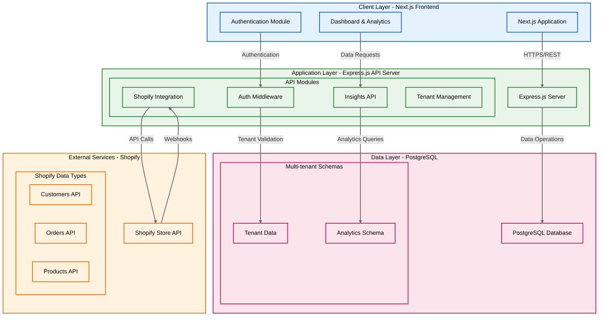

# Xeno FDE - Shopify Data Ingestion & Insights Platform

A sophisticated multi-tenant Shopify data ingestion and analytics platform built for the Xeno FDE internship assignment.

## 🏗️ System Architecture

### High-Level Architecture





### 🛠️ Tech Stack

- **Backend**: Node.js + Express + Prisma ORM
- **Frontend**: Next.js + React + Recharts
- **Database**: PostgreSQL with multi-tenant architecture
- **Authentication**: JWT-based secure authentication
- **Deployment**: Render (Backend) + Vercel (Frontend)
- **Styling**: Modern CSS with responsive design

## 🚀 Quick Start Guide

### Prerequisites
- Node.js 18+ 
- Docker & Docker Compose
- Git

### 1. Clone Repository
```bash
git clone https://github.com/souvik03-136/xeno-fde-task.git
cd xeno-fde-task
```

### 2. Backend Setup
```bash
cd backend
npm install
cp .env.example .env
# Edit .env with your configuration
```

### 3. Start Database
```bash
# From project root
docker-compose up -d
```

### 4. Initialize Database
```bash
cd backend
npx prisma generate
npx prisma db push
```

### 5. Start Backend Server
```bash
npm run dev
# Backend runs on http://localhost:3001
```

### 6. Frontend Setup
```bash
cd frontend
npm install
# Create .env.local with:
# NEXT_PUBLIC_API_URL=http://localhost:3001/api
```

### 7. Start Frontend Application
```bash
npm run dev
# Frontend runs on http://localhost:3000
```

## 📡 API Endpoints

### Authentication
- `POST /api/auth/register` - User registration
- `POST /api/auth/login` - User login

### Tenant Management
- `GET /api/tenant` - List user's tenants
- `POST /api/tenant` - Create new tenant

### Shopify Integration
- `POST /api/shopify/sync` - Manual data synchronization
- `POST /api/shopify/webhook` - Shopify webhook handler

### Analytics & Insights
- `GET /api/insights/dashboard` - Dashboard statistics
- `GET /api/insights/customers` - Customer analytics
- `GET /api/insights/products` - Product performance

## 🗄️ Database Schema

### Core Models
- **User**: Authentication and tenant ownership
- **Tenant**: Multi-tenant store configuration
- **Customer**: Shopify customer data
- **Product**: Product catalog information
- **Order**: Order transactions
- **OrderItem**: Order line items

### Multi-Tenancy Implementation
Data isolation is achieved through a sophisticated tenant-based access control system using `tenantId` foreign keys across all business models.

## ✅ Implemented Features

### 🏢 Multi-tenant Architecture
- Complete data isolation per Shopify store
- Tenant-based API access control
- Scalable tenant management system

### 🔌 Shopify Integration
- REST API data ingestion with pagination support
- Webhook support for real-time updates
- Complete customer, product, and order synchronization

### 📊 Dashboard & Analytics
- Comprehensive revenue and order metrics
- Interactive time-series charts using Recharts
- Top customer analysis and insights
- Advanced date range filtering capabilities

### 🔐 Authentication System
- JWT-based user authentication
- Protected routes and API endpoints
- Secure password hashing with bcrypt

## 🌐 Deployment

### Backend (Render)
1. Create Render account and connect GitHub repository
2. Create Web Service with configuration:
   - Build Command: `cd backend && npm install && npx prisma generate`
   - Start Command: `cd backend && npm start`
3. Add required environment variables
4. Deploy application

### Frontend (Vercel)
1. Connect GitHub repository to Vercel
2. Set build settings:
   - Framework: Next.js
   - Root Directory: frontend
3. Configure environment variables
4. Deploy application

### Database
- Use Render's PostgreSQL add-on
- Alternatively, connect external provider (Neon, Supabase)

## ⚠️ Known Limitations

- Requires Shopify Private App tokens for API access
- Pagination implemented for 250 records per API call
- Webhook verification not yet implemented
- Basic error handling implementation
- No real-time dashboard updates

## 🔜 Next Steps for Production

### Enhanced Security
- Implement Shopify webhook verification
- Add comprehensive rate limiting
- Advanced input validation & sanitization

### Scalability Improvements
- Redis integration for caching
- Background job queues for data processing
- Database connection pooling optimization

### Monitoring & Observability
- Structured logging framework implementation
- Error tracking with Sentry integration
- Performance monitoring setup

### Testing Infrastructure
- Unit tests for API endpoints
- Integration tests for Shopify synchronization
- Frontend component testing

### Advanced Features
- Real-time notifications system
- Advanced predictive analytics
- Custom event tracking framework
- Bulk data operations support

## 🎯 Assumptions Made

- Users may manage single or multiple Shopify stores
- Email/password authentication sufficient for MVP
- Manual/scheduled data sync frequency acceptable
- Modern browser support only required
- English as primary language for initial release

---

## 📞 Contact Information

For questions or support regarding this implementation, please contact:

[Souvik Mahanta]  
[souvikmahanta2003@gmail.com]  
[[Github](https://github.com/souvik03-136)]
[[Linkedin](https://www.linkedin.com/in/souvik-mahanta)]

---


## 🌐 Deployment

### Backend (Render)
1. Create Render account and connect GitHub repository
2. Create Web Service with configuration:
   - Build Command: `cd backend && npm install && npx prisma generate`
   - Start Command: `cd backend && npm start`
3. Add required environment variables
4. Deploy application

### Frontend (Vercel)
1. Connect GitHub repository to Vercel
2. Set build settings:
   - Framework: Next.js
   - Root Directory: frontend
3. Configure environment variables
4. Deploy application

### Database
- Use Render's PostgreSQL add-on
- Alternatively, connect external provider (Neon, Supabase)

---

## 📖 Usage Instructions

### Make the scripts executable
```bash
chmod +x setup.sh
chmod +x deploy.sh
````

### For local development

```bash
./setup.sh
```

### For production deployment

```bash
# First, copy and configure the environment file
cp .env.template .env
# Edit .env with your production values

# Then deploy
./deploy.sh
```

### For CI/CD with GitHub Actions

Set up secrets in your GitHub repository:

* **SERVER\_HOST**: Your server IP/hostname
* **SERVER\_USER**: SSH username
* **SERVER\_SSH\_KEY**: Private SSH key for deployment


```


**Note**: This implementation represents a complete solution for the Xeno FDE internship assignment with a clean, scalable architecture designed for future expansion.