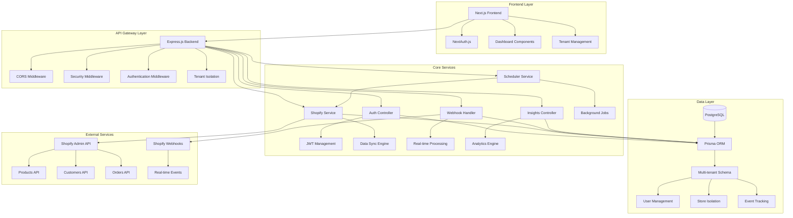
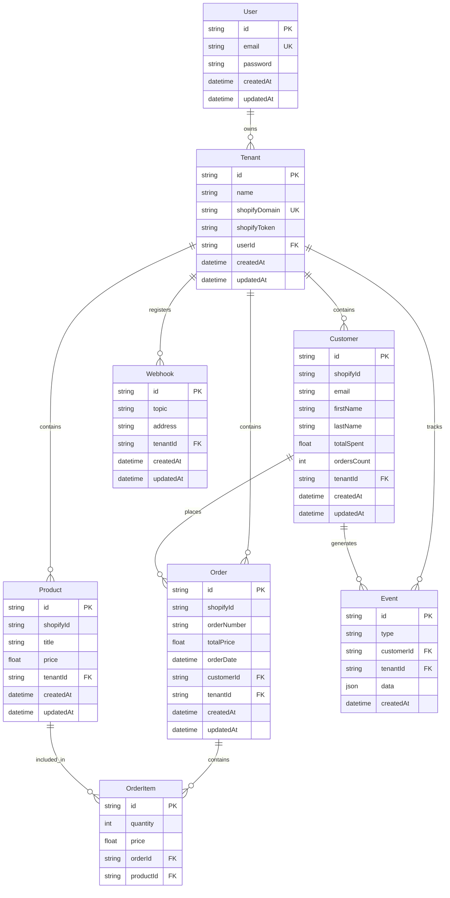

# Xeno FDE Task - Multi-Tenant Shopify Data Ingestion & Insights Service

## Project Overview

A comprehensive multi-tenant Shopify data ingestion and analytics platform that enables enterprise retailers to connect their Shopify stores, sync customer and order data, and gain actionable business insights through an intuitive dashboard.

## System Architecture

## Data Model Architecture

## API Endpoints

### Authentication Endpoints
- `POST /api/auth/register` - User registration
- `POST /api/auth/login` - User authentication

### Tenant Management
- `POST /api/tenant` - Create new tenant store
- `GET /api/tenant` - List user's tenant stores

### Shopify Integration
- `POST /api/shopify/sync` - Manual data synchronization
- `POST /api/shopify/webhooks/register` - Register Shopify webhooks
- `GET /api/shopify/:resource` - Fetch Shopify resources (products/customers/orders)
- `GET /api/shopify/:resource/:id` - Fetch specific Shopify resource

### Analytics & Insights
- `GET /api/insights/dashboard` - Get dashboard statistics with date filtering
- `GET /api/insights/abandoned-carts` - Get abandoned cart events

### Webhook Processing
- `POST /api/webhook/:tenantId` - Process incoming Shopify webhooks

## Key Features

### Multi-Tenant Architecture
- **Tenant Isolation**: Complete data separation between different Shopify stores
- **User-Tenant Mapping**: Single user can manage multiple stores
- **Secure Access Control**: Middleware ensures users can only access their own tenant data

### Real-Time Data Synchronization
- **Initial Bulk Sync**: Comprehensive data import from Shopify APIs
- **Webhook Integration**: Real-time updates for orders, customers, and products
- **Scheduled Sync**: Daily automated synchronization via cron jobs
- **Error Handling**: Robust retry mechanisms and error logging

### Comprehensive Analytics
- **Revenue Tracking**: Total revenue with date range filtering
- **Customer Insights**: Top customers by spending and order frequency
- **Order Analytics**: Order trends over time with visual charts
- **Product Performance**: Revenue breakdown by product categories
- **Abandoned Cart Tracking**: Cart abandonment events and recovery opportunities

### Security Implementation
- **JWT Authentication**: Secure token-based authentication system
- **Password Hashing**: bcrypt for secure password storage
- **Rate Limiting**: API rate limiting to prevent abuse
- **CORS Configuration**: Proper cross-origin resource sharing setup
- **Webhook Verification**: HMAC signature verification for Shopify webhooks

## Technical Implementation Details

### Backend Architecture
- **Framework**: Express.js with TypeScript-like structure
- **ORM**: Prisma for type-safe database operations
- **Database**: PostgreSQL with multi-tenant schema design
- **Authentication**: JWT with 7-day expiration
- **Validation**: Joi schema validation for all inputs
- **Error Handling**: Centralized error handling with proper status codes

### Frontend Architecture
- **Framework**: Next.js with React components
- **Authentication**: NextAuth.js for session management
- **State Management**: React hooks with local storage
- **Charts**: Recharts for data visualization
- **API Integration**: Axios with interceptors for auth and tenant headers
- **Responsive Design**: Mobile-first responsive interface

### Data Flow
1. **User Registration/Login**: JWT token generation and session management
2. **Tenant Setup**: Store creation with Shopify domain and optional access token
3. **Data Sync**: Comprehensive data import via Shopify Admin API
4. **Webhook Registration**: Automatic webhook setup for real-time updates
5. **Analytics Processing**: Data aggregation and insight generation
6. **Dashboard Rendering**: Visual representation of business metrics

## Assumptions Made

### Technical Assumptions
- PostgreSQL is available and properly configured
- Shopify stores have Admin API access enabled
- Network connectivity allows webhook delivery from Shopify
- Users have valid Shopify store domains and access tokens

### Business Assumptions
- Each tenant represents a single Shopify store
- Users may manage multiple stores under one account
- Real-time data updates are critical for business decisions
- Historical data analysis requires date range filtering
- Cart abandonment tracking provides valuable business insights

### Operational Assumptions
- Daily automated sync is sufficient for data consistency
- 50 items per API request provides optimal performance
- 7-day JWT expiration balances security and usability
- Rate limiting at 100 requests per 15 minutes prevents abuse

## Production Readiness Considerations

### Scalability Enhancements
- **Database Optimization**
  - Implement database connection pooling
  - Add proper indexing on frequently queried fields
  - Consider database sharding for large-scale multi-tenancy
  - Implement read replicas for analytics queries

- **Caching Strategy**
  - Redis integration for session management and API response caching
  - CDN implementation for static assets and dashboard data
  - Database query result caching for expensive analytics operations

- **Message Queue System**
  - RabbitMQ or AWS SQS for webhook processing
  - Background job processing for data synchronization
  - Retry mechanisms for failed operations

### Security Hardening
- **Enhanced Authentication**
  - Multi-factor authentication (MFA) implementation
  - OAuth 2.0 integration with Shopify Partner accounts
  - Session management with automatic logout
  - Password complexity requirements and rotation policies

- **Data Protection**
  - Encryption at rest for sensitive customer data
  - SSL/TLS enforcement for all communications
  - Regular security audits and vulnerability assessments
  - GDPR compliance for customer data handling

- **API Security**
  - API key management for different access levels
  - Request signing and timestamp validation
  - DDoS protection and advanced rate limiting
  - Input sanitization and SQL injection prevention

### Monitoring & Observability
- **Application Monitoring**
  - Comprehensive logging with structured format (JSON)
  - Error tracking and alerting systems (Sentry, DataDog)
  - Performance monitoring and APM integration
  - Health check endpoints for all services

- **Business Intelligence**
  - Data warehouse integration for advanced analytics
  - Custom reporting capabilities for different user roles
  - Real-time dashboards with WebSocket connections
  - Export functionality for data analysis tools

### Operational Excellence
- **DevOps Pipeline**
  - Automated CI/CD with testing and deployment stages
  - Infrastructure as Code (Terraform, CloudFormation)
  - Container orchestration with Kubernetes
  - Blue-green deployment strategy for zero-downtime updates

- **Data Management**
  - Automated database backups with point-in-time recovery
  - Data archival strategies for long-term storage
  - Data migration tools for schema updates
  - Disaster recovery procedures and testing

### Performance Optimization
- **Frontend Performance**
  - Server-side rendering optimization
  - Image optimization and lazy loading
  - Bundle splitting and code optimization
  - Progressive Web App (PWA) capabilities

- **Backend Performance**
  - API response time optimization
  - Database query optimization
  - Asynchronous processing for heavy operations
  - Load balancing and horizontal scaling

## Technology Stack Summary

### Core Technologies
- **Backend**: Node.js, Express.js, Prisma ORM, PostgreSQL
- **Frontend**: Next.js, React.js, NextAuth.js, Recharts
- **Authentication**: JWT tokens, bcrypt password hashing
- **Integration**: Shopify Admin API, Webhook processing
- **Deployment**: Docker, Cloud platforms (Render, Vercel)

### Development Tools
- **Version Control**: Git with structured commit messages
- **Package Management**: npm with lock files for consistency
- **Environment Management**: dotenv for configuration
- **Testing**: Jest and React Testing Library (recommended for expansion)
- **Code Quality**: ESLint and Prettier for code standardization

