# Xeno FDE Task - Frontend Dashboard

A Next.js-based Shopify analytics dashboard with multi-tenant support, authentication, and comprehensive data visualization.

## Table of Contents

- [Overview](#overview)
- [Architecture](#architecture)
- [Project Structure](#project-structure)
- [Prerequisites](#prerequisites)
- [Installation](#installation)
- [Configuration](#configuration)
- [Running the Application](#running-the-application)
- [Features](#features)
- [Component Overview](#component-overview)
- [API Integration](#api-integration)
- [Authentication Flow](#authentication-flow)
- [Multi-Tenant Architecture](#multi-tenant-architecture)
- [Development Guidelines](#development-guidelines)
- [Troubleshooting](#troubleshooting)
- [Monitoring and Analytics](#monitoring-and-analytics)
- [Additional Notes](#additional-notes)

## Overview

This frontend application is a comprehensive Shopify analytics dashboard built with Next.js that provides:

- **User Authentication**: Secure login/registration with NextAuth.js
- **Multi-Tenant Support**: Manage multiple Shopify stores per user
- **Real-time Analytics**: Interactive charts and dashboards using Recharts
- **Data Synchronization**: Manual sync with Shopify API
- **Responsive Design**: Mobile-friendly interface
- **Session Management**: Persistent user sessions with JWT tokens

## Architecture

### High-Level Architecture Diagram

```mermaid
graph TB
    User[👤 User] --> Browser[🌐 Browser]
    Browser --> NextJS[⚡ Next.js Frontend]
    
    NextJS --> Auth[🔐 NextAuth.js]
    NextJS --> API[📡 API Layer]
    NextJS --> Components[🧩 Components]
    NextJS --> Pages[📄 Pages]
    
    Auth --> JWT[🎫 JWT Tokens]
    API --> Backend[🖥️ Backend API]
    
    Components --> Dashboard[📊 Dashboard]
    Components --> Login[🔑 Login Form]
    Components --> Tenant[🏪 Tenant Setup]
    
    Pages --> Index[🏠 Index]
    Pages --> LoginPage[📝 Login Page]
    Pages --> DashboardPage[📈 Dashboard Page]
    
    Backend --> Shopify[🛍️ Shopify API]
    Backend --> Database[(🗄️ Database)]
```



### Component Architecture


### Authentication Flow


## Project Structure

```
frontend/
├── Dockerfile
├── next.config.js
├── package.json
├── package-lock.json
├── .env.local
├── .env.local.example
└── src/
    ├── components/
    │   ├── Dashboard.js
    │   ├── LoginForm.js
    │   └── TenantSetup.js
    ├── lib/
    │   └── api.js
    ├── pages/
    │   ├── _app.js
    │   ├── api/
    │   │   └── auth/
    │   │       └── [...nextauth].js
    │   ├── dashboard.js
    │   ├── index.js
    │   └── login.js
    └── styles/
        └── globals.css
```

**Directory Structure:**

| Directory | Purpose |
|-----------|---------|
| `components/` | Reusable UI components |
| `lib/` | Utility libraries and configurations |
| `pages/` | Next.js pages and API routes |
| `pages/api/` | Server-side API routes |
| `styles/` | Global styles and CSS |

## Prerequisites

Before setting up the frontend, ensure you have:

- **Node.js**: Version 16.x or higher
- **npm**: Version 8.x or higher
- **Backend API**: Running on port 3001
- **Modern Browser**: Chrome, Firefox, Safari, or Edge

### Check Prerequisites

```bash
node --version
npm --version
```

## Installation

### Step 1: Clone and Navigate

```bash
git clone https://github.com/souvik03-136/xeno-fde-task.git
cd xeno-fde-task/frontend
```

### Step 2: Install Dependencies

```bash
npm install
```

**Installed Packages:**
- Next.js (React framework)
- NextAuth.js (Authentication library)
- Axios (HTTP client)
- Recharts (Chart library)
- React (UI library)

## Configuration

### Step 1: Create Environment File

```bash
cp .env.local.example .env.local
```

### Step 2: Generate NextAuth Secret

```bash
node -e "console.log(require('crypto').randomBytes(64).toString('hex'))"
```

### Step 3: Configure Environment Variables

Edit `.env.local` with your configuration:

```env
NEXTAUTH_URL=http://localhost:3000
NEXTAUTH_SECRET=your_generated_secret_from_step_2
NEXT_PUBLIC_API_URL=http://localhost:3001/api
```

**Environment Variables:**

| Variable | Description | Example |
|----------|-------------|---------|
| `NEXTAUTH_URL` | Frontend URL for NextAuth callbacks | `http://localhost:3000` |
| `NEXTAUTH_SECRET` | Secret key for JWT signing | Generated 64-char hex string |
| `NEXT_PUBLIC_API_URL` | Backend API base URL | `http://localhost:3001/api` |

### Step 4: Verify Backend Connection

Ensure your backend API is running on `http://localhost:3001` before starting the frontend.

## Running the Application

### Development Mode

```bash
npm run dev
```

**Development Server:**
- URL: http://localhost:3000
- Hot Reload: Enabled
- Source Maps: Enabled for debugging

### Production Build

```bash
npm run build
npm start
```

**Environment Comparison:**

| Mode | Command | Port | Hot Reload | Optimization |
|------|---------|------|------------|--------------|
| Development | `npm run dev` | 3000 | ✅ | ❌ |
| Production | `npm run build && npm start` | 3000 | ❌ | ✅ |

## Features

### Authentication System
- User Registration: Create new accounts
- User Login: Secure authentication with JWT
- Session Management: Persistent login state
- Automatic Redirects: Smart routing based on auth state

### Multi-Tenant Management
- Store Creation: Add multiple Shopify stores
- Store Selection: Switch between different stores
- Store Validation: Verify store access and permissions

### Analytics Dashboard
- Overview Tab: Key metrics and KPIs
- Customer Tab: Top customer insights
- Products Tab: Revenue breakdown by product
- Interactive Charts: Line charts, bar charts, and pie charts
- Date Filtering: Custom date range selection
- Real-time Data: Manual sync with Shopify API

### Data Visualization
- **Recharts Integration**: Professional chart library
- **Responsive Charts**: Mobile-friendly visualizations
- **Multiple Chart Types**:
  - Line Charts: Orders and revenue over time
  - Bar Charts: Revenue trends
  - Pie Charts: Product revenue distribution
- **Interactive Tooltips**: Detailed data on hover

## Component Overview

### Dashboard.js

The main analytics component featuring:

**Key Features:**
- Tab-based navigation (Overview, Customers, Products)
- Real-time data synchronization
- Interactive charts with Recharts
- Date range filtering
- Loading states and error handling

**Props**: `onLogout` (function)

**State Management:**
- `stats`: Dashboard data from API
- `loading`: Loading state indicator
- `syncing`: Data synchronization state
- `dateRange`: Date filter selection
- `activeTab`: Current view tab

### LoginForm.js

Authentication component with:

**Features:**
- Login/Register toggle
- Form validation
- NextAuth integration
- Automatic tenant fetching post-login

**Props**: `onLogin` (function)

**State Management:**
- `isLogin`: Toggle between login/register
- `formData`: Form input values
- `loading`: Submission state
- `error`: Error message display

### TenantSetup.js

Store management interface:

**Capabilities:**
- Display existing stores
- Create new store configurations
- Store selection and validation
- Shopify domain and token input

**Props:** 
- `tenants` (array): Available stores
- `onTenantSelect` (function): Store selection callback

**State Management:**
- `showForm`: Form visibility toggle
- `formData`: Store creation inputs
- `loading`: Creation process state

## API Integration

### API Configuration (lib/api.js)

Axios instance with automatic:
- JWT token attachment
- Tenant ID header injection
- Error handling and redirects
- Base URL configuration

### Request Interceptors
- **Authentication**: Adds JWT token from NextAuth session
- **Tenant Context**: Includes tenant ID in headers
- **Error Handling**: Automatic logout on 401 errors

### API Endpoints Used

| Endpoint | Method | Purpose | Headers |
|----------|--------|---------|---------|
| `/auth/login` | POST | User authentication | `Content-Type: application/json` |
| `/auth/register` | POST | User registration | `Content-Type: application/json` |
| `/tenant` | GET | Fetch user's stores | `Authorization`, `x-tenant-id` |
| `/tenant` | POST | Create new store | `Authorization`, `Content-Type: application/json` |
| `/insights/dashboard` | GET | Analytics data | `Authorization`, `x-tenant-id` |
| `/shopify/sync` | POST | Sync Shopify data | `Authorization`, `x-tenant-id` |

## Authentication Flow

### NextAuth.js Configuration

The application uses NextAuth.js with a custom credentials provider:

**Key Configuration:**
- JWT strategy for session management
- Custom login endpoint integration
- Automatic token refresh
- Session persistence across page reloads

### Authentication States


### Session Management
- **Storage**: Browser localStorage for tenant ID
- **Persistence**: NextAuth handles JWT persistence
- **Security**: Automatic token refresh and validation

## Multi-Tenant Architecture

### Tenant Context Flow

```mermaid
graph LR
    User[👤 User] --> Login[🔑 Login]
    Login --> FetchTenants[📋 Fetch Tenants]
    
    FetchTenants --> SingleTenant{Single Tenant?}
    SingleTenant -->|Yes| AutoSelect[⚡ Auto-select]
    SingleTenant -->|No| Selection[🎯 Tenant Selection]
    
    AutoSelect --> Dashboard[📊 Dashboard]
    Selection --> CreateNew[➕ Create New]
    Selection --> SelectExisting[📌 Select Existing]
    
    CreateNew --> Dashboard
    SelectExisting --> Dashboard
    
    Dashboard --> APIRequest[📡 API Request]
    APIRequest --> TenantHeader[🏷️ x-tenant-id Header]
```



### Tenant Storage Strategy
- **Client-side**: localStorage for tenant ID
- **HTTP Headers**: x-tenant-id for API requests
- **Validation**: Server-side tenant ownership verification

## Development Guidelines

### Code Structure Pattern

```javascript
import { useState, useEffect } from 'react';
import { useSession } from 'next-auth/react';
import api from '../lib/api';

export default function ComponentName({ props }) {
  const [state, setState] = useState(initialValue);
  const { data: session } = useSession();
  
  useEffect(() => {
    // Side effects
  }, [dependencies]);
  
  const handleEvent = async () => {
    // Handle events
  };
  
  return (
    <div>
      {/* JSX */}
    </div>
  );
}
```

### Error Handling Pattern

```javascript
const handleAPICall = async () => {
  try {
    setLoading(true);
    setError('');
    
    const response = await api.get('/endpoint');
    // Handle success
    
  } catch (err) {
    console.error('Error:', err);
    setError(err.response?.data?.error || 'An error occurred');
  } finally {
    setLoading(false);
  }
};
```

### State Management
- **Local State**: useState for component-specific data
- **Session State**: NextAuth for authentication
- **Global State**: localStorage for tenant context
- **API State**: Direct API calls with loading states

### Code Standards
- **ES6+ Features**: Use modern JavaScript
- **React Hooks**: Functional components preferred
- **Error Boundaries**: Implement proper error handling
- **Accessibility**: ARIA labels and semantic HTML
- **Responsive Design**: Mobile-first approach

## Troubleshooting

### Common Issues

#### 1. Authentication Errors

**Problem**: "Invalid credentials" or login failures

**Solutions:**
```bash
# Check backend API is running
curl http://localhost:3001/api/auth/login

# Verify environment variables
cat .env.local

# Clear browser storage
# Open Developer Tools > Application > Storage > Clear
```

#### 2. API Connection Issues

**Problem**: "Network Error" or API timeouts

**Solutions:**
```bash
# Verify backend URL
echo $NEXT_PUBLIC_API_URL

# Check backend health
curl http://localhost:3001/health

# Restart both services
npm run dev
```

#### 3. Tenant Selection Problems

**Problem**: Stuck on tenant selection or "No tenants found"

**Solutions:**
```javascript
// Clear tenant data
localStorage.removeItem('tenantId');

// Check API headers in browser DevTools
// Network tab > Request headers should include:
// - Authorization: Bearer <token>
// - x-tenant-id: <tenant-id>
```

#### 4. Chart Rendering Issues

**Problem**: Charts not displaying or console errors

**Solutions:**
```bash
# Reinstall chart dependencies
npm uninstall recharts
npm install recharts

# Check data format in browser console
console.log(stats?.ordersByDate);
```

#### 5. NextAuth Configuration

**Problem**: NextAuth errors or callback issues

**Solutions:**
```bash
# Generate new secret
node -e "console.log(require('crypto').randomBytes(64).toString('hex'))"

# Update .env.local
NEXTAUTH_SECRET=<new-secret>
NEXTAUTH_URL=http://localhost:3000

# Restart development server
npm run dev
```

### Debug Mode

Enable additional logging:

```javascript
// Add to _app.js for debugging
if (process.env.NODE_ENV === 'development') {
  console.log('Session:', session);
  console.log('Router:', router);
}
```

### Performance Issues

```bash
# Bundle analysis
npm run build

# Check for memory leaks in Browser DevTools > Performance tab
```

## Monitoring and Analytics

### Client-Side Error Tracking

```javascript
// Add to _app.js for production error tracking
window.addEventListener('error', (error) => {
  console.error('Global error:', error);
  // Send to error tracking service
});
```

### Performance Monitoring

```javascript
// Add performance markers
performance.mark('dashboard-load-start');
// ... component loading
performance.mark('dashboard-load-end');
performance.measure('dashboard-load', 'dashboard-load-start', 'dashboard-load-end');
```

## Additional Notes

- **Security**: All API calls include proper authentication headers
- **Performance**: Charts are rendered client-side for better UX
- **Scalability**: Component architecture supports easy feature additions
- **Maintenance**: Regular dependency updates recommended

For backend setup and API documentation, refer to [`backend/README.md`](../backend/README.md).